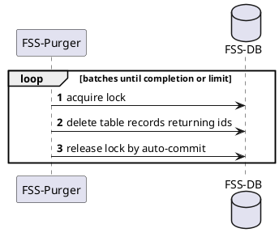
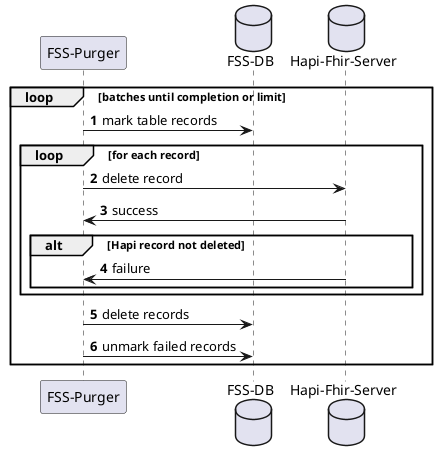
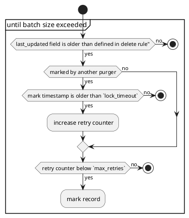

# FHIR-Storage-Purger

THe FHIR-Storage-Purger deletes records from FHIR-Storage and Hapi-Fhir-Server.
It's a K8s CronJob that runs periodically and deletes records based on a set of rules.

<!-- TOC -->
* [FHIR-Storage-Purger](#fhir-storage-purger)
  * [Configuration](#configuration)
    * [Selective deletion periods](#selective-deletion-periods)
      * [Rules](#rules)
  * [Main process](#main-process)
    * [BINARY](#binary)
    * [BUNDLE](#bundle)
      * [Choosing records to delete](#choosing-records-to-delete)
  * [Scaling](#scaling)
    * [Horizontal Scaling](#horizontal-scaling)
    * [Vertical Scaling](#vertical-scaling)
<!-- TOC -->

## Configuration

General configuration parameters for controlling the purger's behavior.

| Parameter                   | Default value | Description                                                     |
|-----------------------------|---------------|-----------------------------------------------------------------|
| FSS_PURGER_ATTEMPTS_MAX     | 3             | Maximum number of purging attempts to be used on a single entry |
| FSS_PURGER_ATTEMPTS_TIMEOUT | 2h            |                                                                 |
| FSS_PURGER_BATCH_LIMIT      | 50            | Maximum number of **batches per resource**                      |
| FSS_PURGER_BATCH_SIZE       | 1000          | Maximum number of records to delete per batch                   |
| FSS_PURGER_LOCKS_TIMEOUT    | 5m            | Timeout for waiting to acquire the lock in the database         |


### Selective deletion periods

Configuration parameters to define specific periods in which records should be deleted.
This will be a K8s ConfigMap provided as YAML.

The config for features:
- `default`: The default period for records that do not match any other rule.
- `bundle-profiles`: A list of rules that define a period for records that match a specific bundle profile.
- `responsible-departments`: A list of rules that define a period for records that have a specific responsible department.

```yaml
periods:
  default-period: 30d
  bundle-profiles:
    - uri: https://demis.rki.de/fhir/StructureDefinition/NotificationBundleDisease
      period: 20d
    - uri: https://demis.rki.de/fhir/StructureDefinition/NotificationBundlePathogen
      period: 20d
  responsible-departments:
    - department: 1.01.0.53.
      period: 60d
```

This is our vision for further features:
- `composition-profiles`: A list of rules that define a period for records that match a specific composition profile.
- `tags`: A list of rules that define a period for records that have a specific tag.

```yaml
periods:
  default-period: 30d
  bundle-profiles:
    - uri: https://demis.rki.de/fhir/StructureDefinition/NotificationBundleDisease
      resource-types:
        - Bundle
        - Binary
      period: 20d
  composition-profiles:
    - uri: https://demis.rki.de/fhir/StructureDefinition/NotificationDiseaseCVDD
      period: 60d
  responsible-departments:
    - department: 1.01.0.53.
      period: 60d
  tags:
    - system: https://demis.rki.de/fhir/CodeSystem/ResponsibleDepartmentNotifier
      code: 1.01.0.53.
      period: 60d
```

#### Rules
This is how we apply the configured deletion periods:
1. If responsible-department and bundle-profile exist, choose the greater value as period.
2. If responsible-department or bundle-profile exists, choose that period.
3. If no responsible-department or bundle-profile exists, choose default-period as period.

## Main process

- Every resource type has a specific purging implementation
- Batch-based purging is used for all resource types
- Access to the database is synchronized with technologies fitting resource type requirements
- All purge implementations are executed in parallel, currently: `binaries`, `bundles`

### BINARY

FHIR binary resources to not require purging at external services. They are only stored in the FHIR-Storage-DB and can be deleted directly.



1. The purger acquires a lock in the database to prevent other purgers from claiming rows at the same time. (https://www.postgresql.org/docs/current/explicit-locking.html#ADVISORY-LOCKS)
2. The purger deletes records from the FHIR-Storage-DB.
3. Auto-Commit of the transaction releases the lock.

### BUNDLE

FHIR bundle resources are stored in the FHIR-Storage-DB and in the Hapi-Fhir-Server. The purger deletes the records from the Hapi-Fhir-Server first and then from the FHIR-Storage-DB.



1. The purger acquires a lock in the database to prevent other purgers from claiming rows at the same time. (https://www.postgresql.org/docs/current/explicit-locking.html#ADVISORY-LOCKS)
2. The purger determines its batch of records to delete and claims them in the database.
    - how the purger determines which records to delete is described [here](#process-how-the-purger-chooses-records-to-delete)
    - the purger claims a record by writing its name and a claim-timestamp into the record
3. The purger releases the lock.
For each record in the batch:
4. The purger tries to delete the record from the Hapi-Fhir-Server.
5. If the record was deleted successfully:
6. The purger deletes the record from the FHIR-Storage-DB.
7. If the record was not deleted successfully:
8. the purger unmarks the record in the database and increases the retry counter.

#### Choosing records to delete


The Purger chooses records to delete based on the following criteria:
- last_updated field is older than defined in delete rule
- not marked by another purger or marked by another purger and mark timestamp is older than a defined timeout
- retry counter is below a defined maximum

Of all records matching these criteria the purger claims the first `batch_size` records. 


## Scaling

The purger is designed to be run in a Kubernetes cluster and can be scaled horizontally and vertically to increase the deletion speed.

### Horizontal Scaling

When multiple instances of the purger are running, they will synchronize with each other through a database lock and process different batches of records.

### Vertical Scaling

The purger uses a thread pool to parallelize the deletion of records. The size of the thread pool is dynamically adjusted based on the number of CPU cores available.
